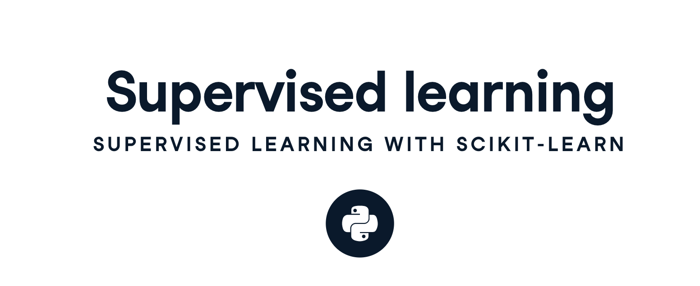
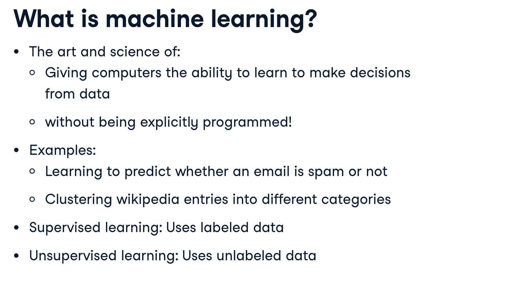
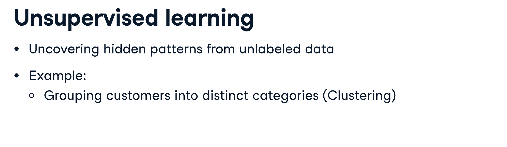
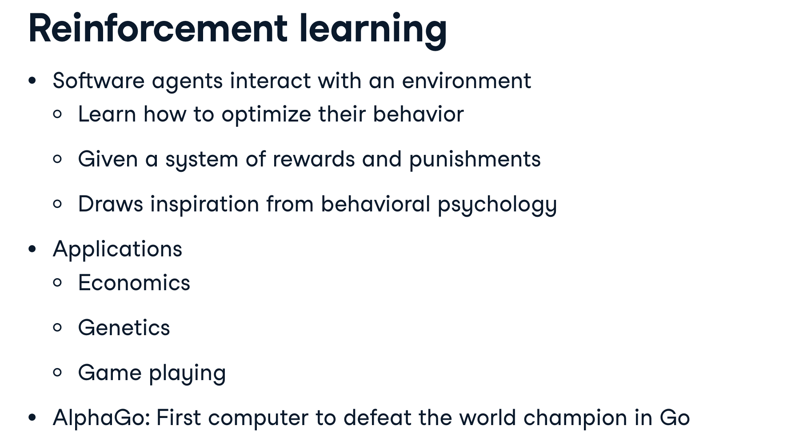
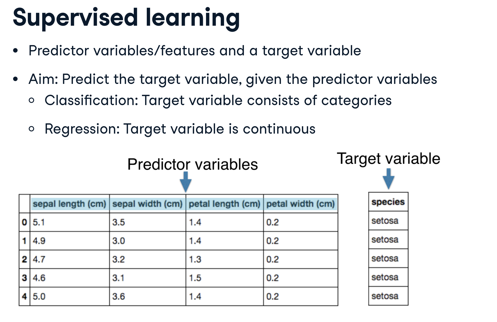
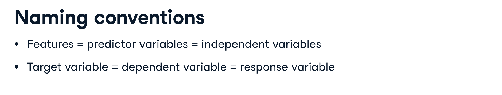
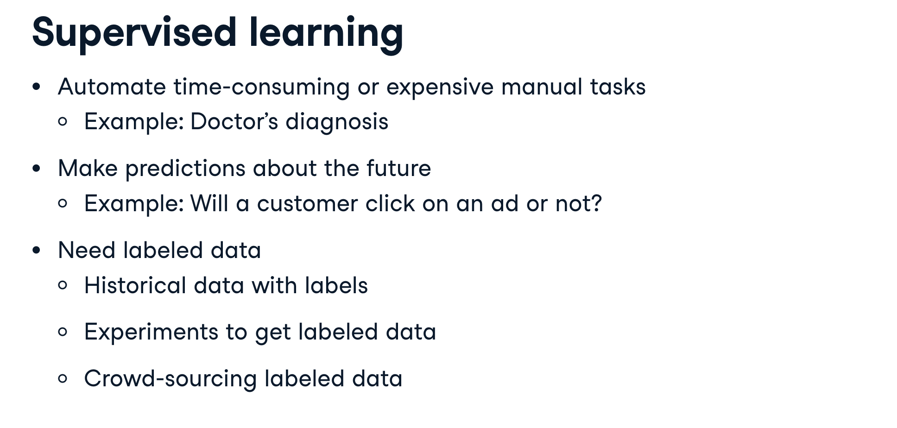
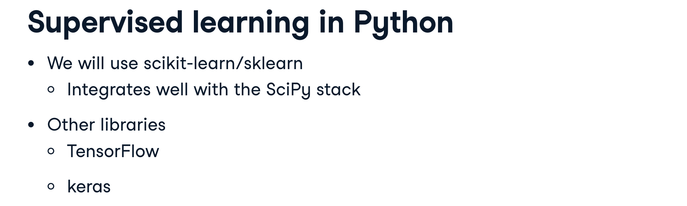

# 1 Classification

## Supervised learning

## Which of these is a classification problem?

## Exploratory data analysis

## Numerical EDA

## Visual EDA

## The classification challenge

## k-Nearest Neighbors: Fit

## k-Nearest Neighbors: Predict

## Measuring model performance

## The digits recognition dataset

## Train/Test Split + Fit/Predict/Accuracy

## Overfitting and underfitting

# 2 Regression

## Introduction to regression

## Which of the following is a regression problem?

## Importing data for supervised learning

## Exploring the Gapminder data

## The basics of linear regression

## Fit & predict for regression

## Train/test split for regression

## Cross-validation

5-fold cross-validation

## K-Fold CV comparison

## Regularized regression

## Regularization I: Lasso

## Regularization II: Ridge

# 3 Fine-tuning your model

## How good is your model?

## Metrics for classification

## Logistic regression and the ROC curve

## Building a logistic regression model

## Plotting an ROC curve

## Precision-recall Curve

## Area under the ROC curve

## AUC computation

## Hyperparameter tuning

## Hyperparameter tuning with GridSearchCV

## Hyperparameter tuning with RandomizedSearchCV

## Hold-out set for final evaluation

## Hold-out set reasoning

## Hold-out set in practice I: Classification

## Hold-out set in practice II: Regression

# 4 Preprocessing and pipelines

## Preprocessing data

## Exploring categorical features

## Creating dummy variables

## Regression with categorical features

## Handling missing data

## Dropping missing data

## Imputing missing data in a ML Pipeline I

## Imputing missing data in a ML Pipeline II

## Centering and scaling

## Centering and scaling your data

## Centering and scaling in a pipeline

## Bringing it all together I: Pipeline for classification

## Bringing it all together II: Pipeline for regression

## Final thoughts

