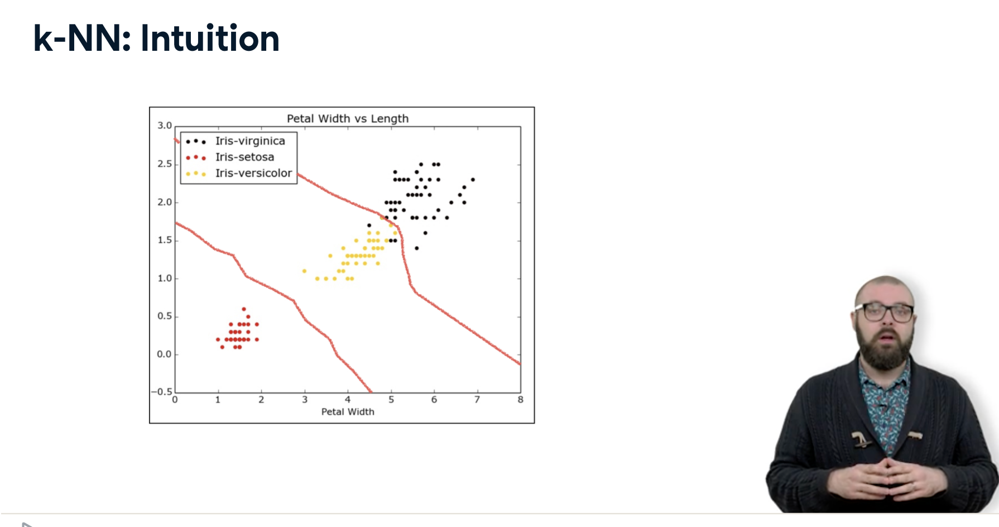
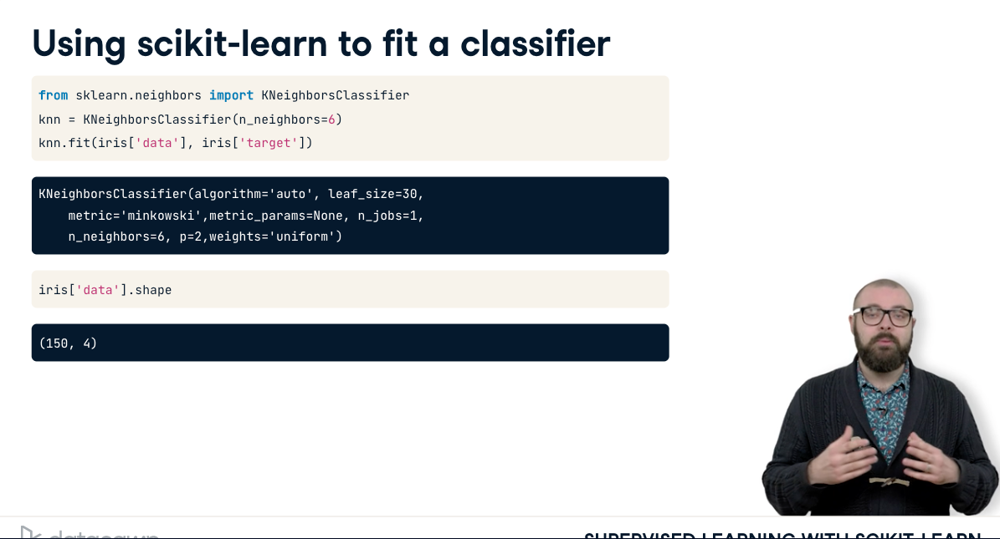

# [Supervised learning with Scikit learn](https://www.datacamp.com/courses/supervised-learning-with-scikit-learn)

# 1 Classification


## Supervised learning


## Which of these is a classification problem?

## Exploratory data analysis
### Load Iris dataset
```python
from sklearn import datasets
import pandas as pd

import numpy as np

import matpLotlib.pyplot as plt

plt.style.use('ggplot')
iris = datasets.load_iris()

type(iris)
```

### View data types and dimensions in dataset

```python
type(iris.data)
iris.data.shape
iris.target_names
```

### Load as pandas dataframe
```python
X = iris.data
y = iris.target
df = pd.DataFrame(X, columns=iris.feature_names)
print(df.head())
```

## Numerical EDA

## Visual EDA

```python
_ = pd.plotting.scatter_matrix(df, c = y, figsize = [8, 8],
s=150, marker = 'D')

```

## The classification challenge


- how to classify point in middle?


- if k = 3, classify as red


- if k = 5, then green


- iris dataset


- Knn algorithm creates decision boundary sets.  Visualize the 2D case below



- new data points that fall within these boundaries will be classified as follows


- All machine learning models implemented as python classes.  They implement learning and predicting models as well as storing info learned from data
- Training a model = fitting


- Fit a classifier using scikit learn
- Instantiate KKneighbors classifier with n_neighbors = 6, assign it to variable `knn`


- fit classifier to training set, the labelled data


 - both features (data) and target (labels) are numpy arrays
 - Scikit learn api data requirements
   - Data inputs must be numpy arrays or pandas dataframe
   - features take on continuous values and not have missing data
   - specifically features are in an array where each column is a feature and each row a different observation or datapoint



- looking at iris data, there are 150 observations and 4 features
- target (labels) needs to be a single column with the same number of observations as feature data

- what's returned from the classifier
  - the classifier itself, and it modifies it to fit to the data...
- now use it to fit on unlabelled data


- the `knn` object now has predict method after running the fit method.
- Again the api requires that features are columns and observations are rows (typical to tidy data)
- check the shape


- if you print the "prediction" it's an array of n predictions (number of rows) and prediction value (in this case, 1 = versicolor, 0 = setosa)


### Using scikit-learn to fit a classifier

```python
from sklearn import datasets
from sklearn.neighbors import KNeighborsClassifier
knn = KNeighborsClassifier(n_neighbors=6)
iris = datasets.load_iris()
knn.fit(iris['data'], iris['target'])
```

## k-Nearest Neighbors: Fit

k-Nearest Neighbors: Fit
Having explored the Congressional voting records dataset, it is time now to build your first classifier. In this exercise, you will fit a k-Nearest Neighbors classifier to the voting dataset, which has once again been pre-loaded for you into a DataFrame df.

In the video, Hugo discussed the importance of ensuring your data adheres to the format required by the scikit-learn API. The features need to be in an array where each column is a feature and each row a different observation or data point - in this case, a Congressman's voting record. The target needs to be a single column with the same number of observations as the feature data. We have done this for you in this exercise. Notice we named the feature array X and response variable y: This is in accordance with the common scikit-learn practice.

Your job is to create an instance of a k-NN classifier with 6 neighbors (by specifying the n_neighbors parameter) and then fit it to the data. The data has been pre-loaded into a DataFrame called df.

### Instructions
- Import KNeighborsClassifier from sklearn.neighbors.
- Create arrays X and y for the features and the target variable. Here this has been done for you. Note the use of .drop() to drop the target variable 'party' from the feature array X as well as the use of the .values attribute to ensure X and y are NumPy arrays. Without using .values, X and y are a DataFrame and Series respectively; the scikit-learn API will accept them in this form also as long as they are of the right shape.
- Instantiate a KNeighborsClassifier called knn with 6 neighbors by specifying the n_neighbors parameter.
- Fit the classifier to the data using the .fit() method.

```python
# Import KNeighborsClassifier from sklearn.neighbors
from sklearn.neighbors import KNeighborsClassifier

# Create arrays for the features and the response variable
y = df['party'].values
X = df.drop('party', axis=1).values

# Create a k-NN classifier with 6 neighbors
knn = KNeighborsClassifier(n_neighbors=6)

# Fit the classifier to the data
knn.fit(X,y)

```

## k-Nearest Neighbors: Predict
k-Nearest Neighbors: Predict
Having fit a k-NN classifier, you can now use it to predict the label of a new data point. However, there is no unlabeled data available since all of it was used to fit the model! You can still use the .predict() method on the X that was used to fit the model, but it is not a good indicator of the model's ability to generalize to new, unseen data.

In the next video, Hugo will discuss a solution to this problem. For now, a random unlabeled data point has been generated and is available to you as X_new. You will use your classifier to predict the label for this new data point, as well as on the training data X that the model has already seen. Using .predict() on X_new will generate 1 prediction, while using it on X will generate 435 predictions: 1 for each sample.

The DataFrame has been pre-loaded as df. This time, you will create the feature array X and target variable array y yourself.

### Instructions
- Create arrays for the features and the target variable from df. As a reminder, the target variable is 'party'.
- Instantiate a KNeighborsClassifier with 6 neighbors.
- Fit the classifier to the data.
- Predict the labels of the training data, X.
- Predict the label of the new data point X_new.

```python
# Import KNeighborsClassifier from sklearn.neighbors
from sklearn.neighbors import KNeighborsClassifier

# Create arrays for the features and the response variable
y = df['party'].values
X = df.drop('party', axis=1).values

# Create a k-NN classifier with 6 neighbors: knn
knn = KNeighborsClassifier(n_neighbors=6)

# Fit the classifier to the data
knn.fit(X,y)

# Predict the labels for the training data X
y_pred = knn.predict(X)

# Predict and print the label for the new data point X_new
new_prediction = knn.predict(X_new)
print("Prediction: {}".format(new_prediction))

```

## Measuring model performance

- need metrics to measure performance = accuracy = no. of correct prediction divided by no. of data points
- which data to use to compute accuracy?


- cannot use the same data used for training, not indicative of generalizing.
- so need to split data into training and test set


...


### Train/test split
```python
from sklearn.model_selection import train_test_split

X_train, X_test, y_train, y_test = train_test_split(X, y, test_size=0.3, random_state=21, stratify=y)
knn = KNeighborsClassifier(n_neighbors=8)
knn.fit(X_train, y_train)
y_pred = knn.predict(X_test)
print(\"Test set predictions:\\n {}\".format(y_pred))

```


## The digits recognition dataset

Up until now, you have been performing binary classification, since the target variable had two possible outcomes. Hugo, however, got to perform multi-class classification in the videos, where the target variable could take on three possible outcomes. Why does he get to have all the fun?! In the following exercises, you'll be working with the MNIST digits recognition dataset, which has 10 classes, the digits 0 through 9! A reduced version of the MNIST dataset is one of scikit-learn's included datasets, and that is the one we will use in this exercise.

Each sample in this scikit-learn dataset is an 8x8 image representing a handwritten digit. Each pixel is represented by an integer in the range 0 to 16, indicating varying levels of black. Recall that scikit-learn's built-in datasets are of type Bunch, which are dictionary-like objects. Helpfully for the MNIST dataset, scikit-learn provides an 'images' key in addition to the 'data' and 'target' keys that you have seen with the Iris data. Because it is a 2D array of the images corresponding to each sample, this 'images' key is useful for visualizing the images, as you'll see in this exercise (for more on plotting 2D arrays, see Chapter 2 of DataCamp's course on Data Visualization with Python). On the other hand, the 'data' key contains the feature array - that is, the images as a flattened array of 64 pixels.

Notice that you can access the keys of these Bunch objects in two different ways: By using the . notation, as in digits.images, or the [] notation, as in digits['images'].

For more on the MNIST data, check out this exercise in Part 1 of DataCamp's Importing Data in Python course. There, the full version of the MNIST dataset is used, in which the images are 28x28. It is a famous dataset in machine learning and computer vision, and frequently used as a benchmark to evaluate the performance of a new model.

```python
# Import necessary modules
from sklearn import datasets
import matplotlib.pyplot as plt

# Load the digits dataset: digits
digits = datasets.load_digits()

# Print the keys and DESCR of the dataset
print(digits.keys())
print(digits.DESCR)

# Print the shape of the images and data keys
print(digits.images.shape)
print(digits.data.shape)

# Display digit 1010
plt.imshow(digits.images[1010], cmap=plt.cm.gray_r, interpolation='nearest')
plt.show()
```

## Train/Test Split + Fit/Predict/Accuracy

Now that you have learned about the importance of splitting your data into training and test sets, it's time to practice doing this on the digits dataset! After creating arrays for the features and target variable, you will split them into training and test sets, fit a k-NN classifier to the training data, and then compute its accuracy using the .score() method.

- Import KNeighborsClassifier from sklearn.neighbors and
- train_test_split from sklearn.model_selection
- Create an array for the features using digits.data and an array for the
- target using digits.target .
- Create stratified training and test sets using 0.2 for the size of the test
- set. Use a random state of 42 . Stratify the split according to the labels so
- that they are distributed in the training and test sets as they are in the
- original dataset.
- Create a k-NN classifier with 7 neighbors and fit it to the training data.
- Compute and print the accuracy of the classifier's predictions using the
.score() method.

```python
# Import necessary modules
from sklearn.neighbors import KNeighborsClassifier
from sklearn.model_selection import train_test_split

# Create feature and target arrays
X = digits.data
y = digits.target

# Split into training and test set
X_train, X_test, y_train, y_test = train_test_split(X, y, test_size = 0.2, random_state=42, stratify=y)

# Create a k-NN classifier with 7 neighbors: knn
knn = KNeighborsClassifier(n_neighbors=7)

# Fit the classifier to the training data
knn.fit(X_train, y_train)

# Print the accuracy
print(knn.score(X_test, y_test))

```

## Overfitting and underfitting

Remember the model complexity curve that Hugo showed in the video? You will now construct such a curve for the digits dataset! In this exercise, you will compute and plot the training and testing accuracy scores for a variety of different neighbor values. By observing how the accuracy scores differ for the training and testing sets with different values of k, you will develop your intuition for overfitting and underfitting.

The training and testing sets are available to you in the workspace as X_train, X_test, y_train, y_test. In addition, KNeighborsClassifier has been imported from sklearn.neighbors.

Inside the for loop:

- Setup a k-NN classifier with the number of neighbors equal to k .
- Fit the classifier with k neighbors to the training data.
- Compute accuracy scores the training set and test set separately using the .score() method and assign the results to the train_accuracy and test_accuracy arrays respectively.


---


---

# 2 Regression


## Introduction to regression

## Which of the following is a regression problem?

## Importing data for supervised learning

## Exploring the Gapminder data

## The basics of linear regression

## Fit & predict for regression

## Train/test split for regression

## Cross-validation

## 5-fold cross-validation

## K-Fold CV comparison

## Regularized regression

## Regularization I: Lasso

## Regularization II: Ridge


# 3 Fine-tuning your model


## How good is your model?

## Metrics for classification

## Logistic regression and the ROC curve

## Building a logistic regression model

## Plotting an ROC curve

## Precision-recall Curve

## Area under the ROC curve

## AUC computation

## Hyperparameter tuning

## Hyperparameter tuning with GridSearchCV

## Hyperparameter tuning with RandomizedSearchCV

## Hold-out set for final evaluation

## Hold-out set reasoning

## Hold-out set in practice I: Classification

## Hold-out set in practice II: Regression


# 4 Preprocessing and pipelines


## Preprocessing data

## Exploring categorical features

## Creating dummy variables

## Regression with categorical features

## Handling missing data

## Dropping missing data

## Imputing missing data in a ML Pipeline I

## Imputing missing data in a ML Pipeline II

## Centering and scaling

## Centering and scaling your data

## Centering and scaling in a pipeline

## Bringing it all together I: Pipeline for classification

## Bringing it all together II: Pipeline for regression

## Final thoughts

